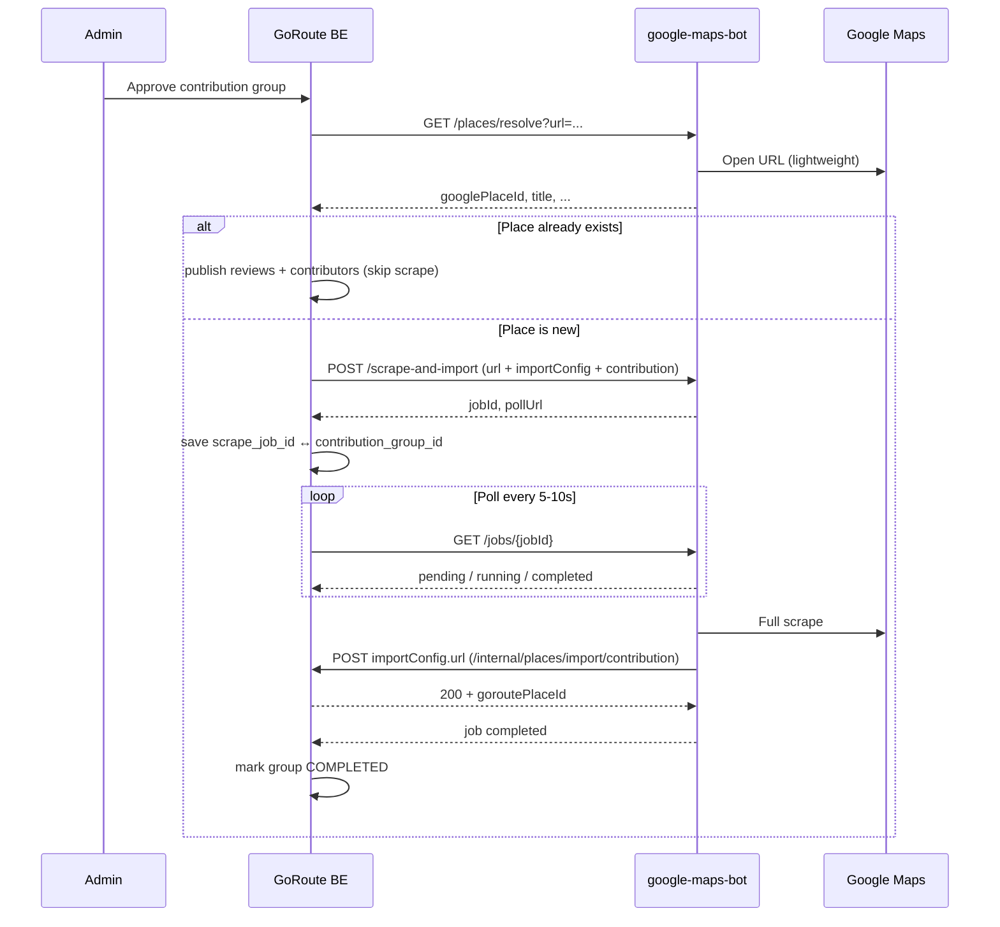

# Place Import API Specs v2

Base URL (local): `http://localhost:8080`

Internal use only — **no authentication**.

Interactive docs:
- Swagger UI: `/docs`
- ReDoc: `/redoc`
- OpenAPI JSON: `/openapi.json`

---

## Integration Flow (GoRoute ↔ Scrape Service)



**Rules:**
- Contribution flow **must not** use `/v1/api/places/import` (updates existing place). Use `/internal/places/import/contribution` instead.
- Without `contribution` → legacy flow: scrape + POST default `GOROUTE_API_URL` (`/places/import`).
- HTTP `409 ALREADY_PROCESSED` from GoRoute → treated as **success** (idempotent retry).

---

## Environment Variables

| Variable | Default | Description |
|----------|---------|-------------|
| `PLACE_API_HOST` | `0.0.0.0` | Bind host |
| `PLACE_API_PORT` | `8080` | Bind port |
| `PLACE_API_MAX_WORKERS` | `1` | Background job concurrency. Keep at `1` on the 2 GB scraper container to avoid overlapping Chrome/ffmpeg/Whisper workloads. |
| `PLACE_BROWSER_MAX_CONCURRENCY` | `1` | Process-wide Chrome capacity shared by Maps and social browser fallbacks. |
| `PLACE_BROWSER_PAGE_LOAD_STRATEGY` | `eager` | Return after the DOM is ready instead of waiting for every nonessential resource. |
| `PLACE_BROWSER_BLOCK_NONESSENTIAL` | `true` | Block fonts, media and analytics requests that are not used by place/review extraction. |
| `PLACE_BROWSER_BLOCK_IMAGES` | `true` | Prevent Chrome from decoding image binaries; review image URLs remain available in the DOM and are downloaded later by the backend image pipeline. |
| `PLACE_JOB_HISTORY_TTL_HOURS` | `24` | Retain completed in-memory jobs for this many hours. |
| `PLACE_JOB_HISTORY_MAX_COUNT` | `200` | Maximum completed jobs retained in process memory. Active jobs are never pruned. |
| `PLACE_REVIEW_BROWSER_CRASH_RETRIES` | `1` | Retry the current place once with a fresh browser when Chrome reports a crashed tab/session. |
| `GOROUTE_API_URL` | `https://onestudy.id.vn/goroute/v1/api/places/import` | Legacy import target (no contribution) |
| `GOROUTE_PLACES_URL` | derived from `GOROUTE_API_URL` | DB-backed endpoint used to list places for refresh |
| `PLACE_REFRESH_ENABLED` | `true` | Enable the daily place-detail refresh |
| `PLACE_REFRESH_HOUR` | `6` | Daily refresh hour |
| `PLACE_REFRESH_MINUTE` | `0` | Daily refresh minute |
| `PLACE_REFRESH_TIMEZONE` | `Asia/Bangkok` | Scheduler timezone |
| `PLACE_REFRESH_MAX_PLACES` | `0` | Scheduled run cap; `0` means all eligible places |
| `PLACE_REFRESH_API_KEY` | empty | Optional `X-API-Key` required by maintenance endpoints |

---

## Endpoints

### Daily place-detail refresh

The service automatically queues one sequential refresh every day at `06:00`
in `PLACE_REFRESH_TIMEZONE`. Only places with a valid Google Maps place URL are
processed. Review scraping is disabled for this maintenance job.

Trigger manually:

```http
POST /api/v1/maintenance/places/refresh-details
Content-Type: application/json
X-API-Key: <PLACE_REFRESH_API_KEY, only when configured>

{
  "place_id": null,
  "max_places": null,
  "headless": true,
  "continue_on_error": true
}
```

To test exactly one DB place, pass its GoRoute UUID:

```json
{
  "place_id": "8a344c3f-4205-4db6-9bdf-3bd9f0bd77dc"
}
```

When `place_id` is present, `max_places` is ignored and the service reads only
`GET /v1/api/places/{place_id}` instead of loading the complete place list.

The response contains a `jobId`. Poll it using the existing job endpoint:

```http
GET /api/v1/jobs/{jobId}
```

Inspect the configured schedule and its next run:

```http
GET /api/v1/maintenance/places/refresh-details/schedule
```

If a scheduled or manually triggered refresh is already active, another manual
trigger returns HTTP `409` with the active `jobId`.

### 1. Health Check

```http
GET /api/v1/health
```

**Response `200`**

```json
{
  "status": "ok",
  "service": "place-import-api"
}
```

---

### 2. Extract Social Video Location

Extract place candidates from TikTok/Instagram using audio + frames/slides.
Caption/title/tags are sent to the selected AI provider as context only, not trusted source.

OpenAI Chat Completions uses `max_completion_tokens` and explicitly instructs the model to return a valid JSON object whenever `response_format.type=json_object` is enabled. DeepSeek and custom OpenAI-compatible providers retain their existing `max_tokens` payload for compatibility.

Photo carousel handling:
- All carousel images are downloaded in source order and resized/compressed before AI extraction.
- Carousel audio/music is never downloaded or transcribed.
- Temporary source images and processed images are deleted when the job finishes unless `keep_temp=true`.

Requirements:
- Provider key: `ANTHROPIC_API_KEY`, `DEEPSEEK_API_KEY`, `OPENAI_API_KEY`, or `AI_API_KEY` for a custom OpenAI-compatible provider.
- Provider/model/base URL can be supplied per request. If omitted, worker env `AI_PROVIDER`, `AI_MODEL`, and `AI_BASE_URL` are used.
- Audio transcription priority:
  1. `GROQ_API_KEY` if configured.
  2. `OPENAI_API_KEY` if configured.
  3. Local `faster-whisper` if `LOCAL_WHISPER_ENABLED=true` (default).
- `ffmpeg` and `yt-dlp` available in the runtime.

Local Whisper env:

| Variable | Default | Description |
|----------|---------|-------------|
| `LOCAL_WHISPER_ENABLED` | `true` | Use local faster-whisper when no hosted STT key is configured |
| `LOCAL_WHISPER_MODEL` | `small` | Model size: `tiny`, `base`, `small`, `medium`, etc. |
| `LOCAL_WHISPER_DEVICE` | `cpu` | Use `cuda` only if the container/host has GPU support |
| `LOCAL_WHISPER_COMPUTE_TYPE` | `int8` | Good CPU default |
| `LOCAL_WHISPER_LANGUAGE` | `vi` | Set blank for auto-detect |
| `LOCAL_WHISPER_CACHE_DIR` | empty/local default | Docker default is `/app/model-cache` |

```http
POST /api/v1/social-location/extract
Content-Type: application/json
```

```json
{
  "url": "https://www.tiktok.com/@user/video/1234567890",
  "language": "vi",
  "dry_run": false,
  "debug_output_dir": null,
  "max_audio_seconds": 75,
  "max_frames": 30,
  "frame_interval_seconds": 4,
  "image_max_width": 384,
  "image_jpeg_quality": 12,
  "ai_provider": "DEEPSEEK",
  "ai_model": "deepseek-v4-flash",
  "ai_base_url": "https://api.deepseek.com",
  "include_map_search": true,
  "map_search_limit": 3,
  "headless": true
}
```

Dry run mode saves AI inputs to disk and stops before AI/map search:

```json
{
  "url": "https://www.tiktok.com/@yeudanang24/video/7660500838770543880",
  "language": "vi",
  "dry_run": true,
  "debug_output_dir": "debug/social-location/test-yeudanang",
  "max_audio_seconds": 30,
  "max_frames": 30,
  "frame_interval_seconds": 4,
  "image_max_width": 384,
  "image_jpeg_quality": 12,
  "include_map_search": false
}
```

Dry run output folder contains:
- `transcript.txt`
- `caption.txt`
- `ai_input_text.txt`
- `metadata.json`
- `request.json`
- `manifest.json`
- `images/image_01.jpg`, `images/image_02.jpg`, ...

Image sampling/compression:
- Frame timestamps start at second 1 and use `frame_interval_seconds` spacing.
- `max_frames=30` means at most 30 images. API accepts 1-100.
- `image_max_width=384` resizes images down before AI/dry-run output.
- `image_jpeg_quality=12` uses FFmpeg `-q:v 12`; lower is larger/better quality, higher is smaller/lower quality.
- Place extraction has no candidate-count quota. Policy `AI_EVIDENCE_JUDGE_V2` makes the AI classify identity confidence and evidence type; Python applies schema/evidence guardrails, fuzzy transcript validation, deduplication, and Maps ambiguity checks.
- Async jobs publish an accumulated result after each Maps-enriched candidate with callback status `PROCESSING`; only the final callback uses `COMPLETED`.

Response shape:

```json
{
  "success": true,
  "url": "https://www.tiktok.com/@user/video/1234567890",
  "language": "vi",
  "metadata": {
    "platform": "TikTok",
    "title": "...",
    "caption": "...",
    "tags": ["danang"],
    "uploader": "...",
    "duration": 42
  },
  "media": {
    "downloaded": true,
    "audioProvider": "groq:whisper-large-v3-turbo",
    "transcriptAvailable": true,
    "frameCount": 8
  },
  "extraction": {
    "found": true,
    "needs_confirmation": false,
    "summary": "...",
    "useful_summary": "Video gợi ý vài thông tin hữu ích chung về lịch trình, món nên thử hoặc bối cảnh khu vực.",
    "general_guidance": [
      "Các hướng dẫn chung không gắn với riêng một địa điểm sẽ nằm ở đây."
    ],
    "discarded_mentions": [
      {
        "mention": "an unnamed cafe passed on the route",
        "identity_status": "AMBIGUOUS",
        "reason": "The video does not establish a proper name"
      }
    ],
    "candidateValidation": {
      "policy": "AI_EVIDENCE_JUDGE_V2",
      "inputCount": 1,
      "evidenceVerifiedCount": 1,
      "rejectedCount": 0
    },
    "model": "claude-haiku-4-5",
    "candidates": [
      {
        "name": "Cafe Giang",
        "query": "Cafe Giang Hanoi",
        "description": "Ứng viên địa điểm được nhận diện từ lời nói và biển hiệu trong video.",
        "useful_info": [
          "Thông tin hữu ích riêng về Cafe Giang, ví dụ món/điểm nổi bật được nhắc trong video."
        ],
        "visit_guidance": [
          "Hướng dẫn riêng cho Cafe Giang nếu video có nhắc hoặc nhìn thấy bằng chứng."
        ],
        "city_hint": "Hanoi",
        "region_hint": "Northern Vietnam",
        "country_hint": "Vietnam",
        "address_hint": null,
        "search_context": "egg coffee in Hanoi Old Quarter",
        "aliases": ["Café Giảng"],
        "place_type_hint": "cafe",
        "identity_status": "CONFIRMED",
        "mention_type": "MULTIMODAL_CONFIRMED",
        "inference_used": false,
        "uncertainty_reason": null,
        "evidence": [
          {
            "source": "audio",
            "quote": "speaker says Cafe Giang",
            "frame_index": null,
            "supports_identity": true
          },
          {
            "source": "frame",
            "quote": "sign reads Cafe Giang",
            "frame_index": 4,
            "supports_identity": true
          }
        ],
        "resolvedSearchQuery": "Cafe Giang Hanoi Vietnam egg coffee in Hanoi Old Quarter",
        "evidence_sources": ["audio", "frame"],
        "evidence_text": ["speaker says Cafe Giang", "sign reads Cafe Giang"],
        "confidence": 0.88,
        "mapSearch": {
          "success": true,
          "count": 1,
          "candidates": []
        }
      }
    ]
  }
}
```

Social extraction failure codes:

| Code | Meaning |
|------|---------|
| `SOCIAL_VIDEO_DOWNLOAD_BLOCKED` | Video metadata or media could not be obtained from the social platform. |
| `SOCIAL_CAROUSEL_DOWNLOAD_BLOCKED` | A photo carousel was positively identified, but fewer than two usable images could be downloaded or processed. It is not retried as a video. |
| `SOCIAL_VIDEO_DURATION_EXCEEDED` | Video exceeds the configured duration limit. |
| `SOCIAL_VIDEO_DURATION_UNAVAILABLE` | Worker could not verify the downloaded video's duration. |
| `IRRELEVANT_SOCIAL_VIDEO` | AI classified the input as unrelated to travel, food, or a real-world place. |
| `EXTRACTION_FAILED` | Provider or extraction pipeline failed for another reason. |

TikTok `vt.tiktok.com` and `vm.tiktok.com` links are resolved to a canonical `/photo/{id}` or `/video/{id}` URL before media detection. Tracking parameters are removed. TikTok photo posts skip oEmbed/video extraction and are processed as ordered image carousels without downloading the background music.

---

### 3. Resolve URL (check duplicate before scrape)

Lightweight browser open — extracts place metadata **without** scraping reviews.

```http
GET /api/v1/places/resolve?url=https://maps.app.goo.gl/abc123
```

| Query | Required | Default | Description |
|-------|----------|---------|-------------|
| `url` | Yes | — | Google Maps URL |
| `headless` | No | `true` | Headless Chrome |

**Response `200`**

```json
{
  "googlePlaceId": "ChIJxxxxxxxxxxxx",
  "cid": "1234567890123456789",
  "title": "Phở Hà Nội",
  "latitude": 21.0285,
  "longitude": 105.8542,
  "normalizedUrl": "https://www.google.com/maps/place/...",
  "dataId": "0x3135..."
}
```

GoRoute flow: `resolve` → `GET /v1/api/places/google/{placeId}` → if exists, skip scrape.

**Response `422`** — invalid URL  
**Response `502`** — resolve failed

---

### 4. Search Google Maps by Text

Lightweight browser search. Use this when an upstream extractor only has a place
name/address candidate such as `"Banh mi Ba Lan Da Nang"` and not a Google Maps
URL yet. The endpoint returns candidate Google Maps URLs that can then be passed
to `/api/v1/places/resolve` or `/api/v1/places/scrape-and-import`.

```http
GET /api/v1/places/search?query=Banh%20mi%20Ba%20Lan%20Da%20Nang&limit=3
```

```http
POST /api/v1/places/search
Content-Type: application/json
```

```json
{
  "query": "Banh mi Ba Lan Da Nang",
  "latitude": 16.0678,
  "longitude": 108.2208,
  "zoom": 14,
  "limit": 5,
  "headless": true
}
```

| Field | Required | Default | Description |
|-------|----------|---------|-------------|
| `query` | Yes | - | Place name/address search text |
| `latitude` | No | `null` | Optional search bias latitude |
| `longitude` | No | `null` | Optional search bias longitude |
| `zoom` | No | `14` | Google Maps zoom when bias coordinates are provided |
| `limit` | No | `5` | Max candidates, 1-10 |
| `headless` | No | `true` | Headless Chrome |

**Response `200`**

```json
{
  "success": true,
  "query": "Banh mi Ba Lan Da Nang",
  "searchUrl": "https://www.google.com/maps/search/...",
  "resolvedUrl": "https://www.google.com/maps/search/...",
  "count": 2,
  "candidates": [
    {
      "rank": 1,
      "title": "Banh Mi Ba Lan",
      "googleMapsLink": "https://www.google.com/maps/place/...",
      "resolvedUrl": "https://www.google.com/maps/place/...",
      "placeId": "ChIJxxxxxxxxxxxx",
      "cid": "1234567890123456789",
      "latitude": 16.0678,
      "longitude": 108.2208,
      "ratingText": "4.5",
      "reviewText": "1,234 reviews",
      "rawText": "..."
    }
  ]
}
```

**Response `422`** - invalid request
**Response `502`** - search failed

---

### 5. Scrape and Import (async)

#### Legacy request (backward compatible)

```json
{
  "url": "https://maps.app.goo.gl/abc123",
  "max_reviews": 100,
  "max_scrolls": 100,
  "headless": true
}
```

→ Scrape + POST `{GOROUTE_API_URL}` (`/v1/api/places/import`)

#### Contribution request (GoRoute integration)

```json
{
  "url": "https://maps.app.goo.gl/abc123",
  "importConfig": {
    "enabled": true,
    "url": "http://goroute:8080/v1/api/internal/places/import/contribution",
    "method": "POST",
    "headers": {
      "Authorization": "Bearer YOUR_INTERNAL_TOKEN",
      "Content-Type": "application/json"
    }
  },
  "contribution": {
    "gorouteJobId": "550e8400-e29b-41d4-a716-446655440000",
    "contributionGroupId": "660e8400-e29b-41d4-a716-446655440001",
    "skipPlaceInsertIfExists": true,
    "contributorUserIds": [
      "880e8400-e29b-41d4-a716-446655440003",
      "990e8400-e29b-41d4-a716-446655440005"
    ],
    "gorouteReviews": [
      {
        "contributionId": "770e8400-e29b-41d4-a716-446655440002",
        "userId": "880e8400-e29b-41d4-a716-446655440003",
        "overallRating": 4,
        "foodRating": 5,
        "priceRating": 4,
        "ambianceRating": 4,
        "serviceRating": 5,
        "text": "Phở ngon",
        "photos": ["https://cdn.goroute.app/reviews/abc.jpg"]
      }
    ]
  }
}
```

```http
POST /api/v1/places/scrape-and-import
Content-Type: application/json
```

**Response `200` — job queued (same for both flows)**

```json
{
  "jobId": "3fa85f64-5717-4562-b3fc-2c963f66afa6",
  "status": "pending",
  "message": "Job queued. Poll pollUrl until status is completed or failed.",
  "pollUrl": "/api/v1/jobs/3fa85f64-5717-4562-b3fc-2c963f66afa6"
}
```

**Validation `422`:**
- `contribution` provided without `importConfig`
- Invalid Google Maps URL

**cURL (contribution flow)**

```bash
curl -X POST "http://localhost:8080/api/v1/places/scrape-and-import" \
  -H "Content-Type: application/json" \
  -d '{
    "url": "https://maps.app.goo.gl/abc123",
    "importConfig": {
      "enabled": true,
      "url": "http://goroute:8080/v1/api/internal/places/import/contribution",
      "method": "POST",
      "headers": {
        "Authorization": "Bearer YOUR_INTERNAL_TOKEN",
        "Content-Type": "application/json"
      }
    },
    "contribution": {
      "gorouteJobId": "550e8400-e29b-41d4-a716-446655440000",
      "contributionGroupId": "660e8400-e29b-41d4-a716-446655440001",
      "skipPlaceInsertIfExists": true,
      "contributorUserIds": ["user-uuid-1", "user-uuid-2"],
      "gorouteReviews": [
        {
          "contributionId": "contrib-uuid-1",
          "userId": "user-uuid-1",
          "overallRating": 4,
          "foodRating": 5,
          "priceRating": 4,
          "ambianceRating": 4,
          "serviceRating": 5,
          "text": "Phở ngon",
          "photos": []
        }
      ]
    }
  }'
```

---

### 6. Poll Job Status

```http
GET /api/v1/jobs/{jobId}
```

**Response `200` — running**

```json
{
  "jobId": "3fa85f64-5717-4562-b3fc-2c963f66afa6",
  "status": "running",
  "createdAt": "2026-06-27T10:00:00+00:00",
  "startedAt": "2026-06-27T10:00:01+00:00",
  "input": {
    "url": "https://maps.app.goo.gl/abc123",
    "contributionGroupId": "660e8400-e29b-41d4-a716-446655440001",
    "gorouteJobId": "550e8400-e29b-41d4-a716-446655440000"
  }
}
```

**Response `200` — completed (contribution flow)**

```json
{
  "jobId": "3fa85f64-5717-4562-b3fc-2c963f66afa6",
  "status": "completed",
  "createdAt": "2026-06-27T10:00:00+00:00",
  "startedAt": "2026-06-27T10:00:01+00:00",
  "completedAt": "2026-06-27T10:02:30+00:00",
  "input": {
    "url": "https://maps.app.goo.gl/abc123",
    "contributionGroupId": "660e8400-e29b-41d4-a716-446655440001",
    "gorouteJobId": "550e8400-e29b-41d4-a716-446655440000"
  },
  "result": {
    "googlePlaceId": "ChIJxxxxxxxxxxxx",
    "title": "Phở Hà Nội",
    "placeAlreadyExists": false,
    "importStatus": "success",
    "importHttpStatus": 200,
    "goroutePlaceId": "uuid-internal-place-id",
    "reviewsPublished": 2,
    "contributorsAdded": 2
  }
}
```

**Response `200` — failed**

```json
{
  "jobId": "3fa85f64-5717-4562-b3fc-2c963f66afa6",
  "status": "failed",
  "createdAt": "2026-06-27T10:00:00+00:00",
  "completedAt": "2026-06-27T10:01:10+00:00",
  "input": {
    "url": "https://maps.app.goo.gl/abc123",
    "contributionGroupId": "660e8400-e29b-41d4-a716-446655440001"
  },
  "error": {
    "code": "SCRAPE_FAILED",
    "message": "Could not load place page"
  },
  "result": {
    "googlePlaceId": "",
    "title": "",
    "placeAlreadyExists": false,
    "importStatus": "failed",
    "importHttpStatus": null
  }
}
```

**Error codes**

| Code | Meaning |
|------|---------|
| `SCRAPE_FAILED` | Google Maps scrape error |
| `IMPORT_FAILED` | GoRoute import endpoint rejected request |
| `INTERNAL_ERROR` | Unexpected worker exception |
| `JOB_FAILED` | Generic failure |

Poll every **5–10s**, timeout ~**5 minutes**.

---

### 7. Contribution Import Payload (scrape service → GoRoute)

When job completes with `contribution`, scrape service POSTs to `importConfig.url`:

```json
{
  "jobId": "3fa85f64-5717-4562-b3fc-2c963f66afa6",
  "contributionGroupId": "660e8400-e29b-41d4-a716-446655440001",
  "gorouteJobId": "550e8400-e29b-41d4-a716-446655440000",
  "placeAlreadyExists": false,
  "skipPlaceInsertIfExists": true,
  "place": {
    "placeId": "ChIJxxxxxxxxxxxx",
    "cid": "1234567890123456789",
    "dataId": "0x3135...",
    "title": "Phở Hà Nội",
    "placeGroup": "FOOD_AND_DRINK",
    "category": "Vietnamese restaurant",
    "address": "123 Phố Huế, Hai Bà Trưng, Hà Nội",
    "destinations": ["Hanoi", "Vietnam"],
    "latitude": 21.0285,
    "longitude": 105.8542,
    "plusCode": "7P52+2X",
    "timezone": "Asia/Bangkok",
    "phone": "+84...",
    "website": "https://...",
    "googleMapsLink": "https://www.google.com/maps/place/...",
    "reviewCount": 1250,
    "reviewRating": 4.3,
    "reviewsPerRating": "{\"1\":10,\"2\":20,\"3\":100,\"4\":400,\"5\":720}",
    "thumbnail": "https://...",
    "images": "[{\"image\":\"https://...\",\"title\":\"\"}]",
    "userReviews": "[...google reviews from bot...]",
    "openHours": "{\"Monday\":[\"6 AM - 10 PM\"]}",
    "popularTimes": "{}",
    "rawData": "{...}"
  },
  "gorouteReviews": ["...forwarded unchanged from request.contribution.gorouteReviews..."],
  "contributorUserIds": ["...forwarded unchanged from request.contribution.contributorUserIds..."]
}
```

**Expected GoRoute response (200/201)**

```json
{
  "goroutePlaceId": "uuid-internal-place-id",
  "placeAlreadyExists": false,
  "reviewsPublished": 2,
  "contributorsAdded": 2
}
```

**Idempotent retry (409)**

```json
{
  "code": "ALREADY_PROCESSED",
  "message": "Contribution group already processed"
}
```

→ Scrape service treats as **success**.

**Import endpoint URL (GoRoute internal):**

```
POST /v1/api/internal/places/import/contribution
```

(Configured per-request via `importConfig.url`)

---

### 8. Legacy Import (sync)

```http
POST /api/v1/places/import
```

Upload pre-scraped JSON to default `GOROUTE_API_URL`. No job, returns immediately.

---

### 9. Batch Scrape (async, legacy only)

```http
POST /api/v1/places/scrape-and-import/batch
```

No `contribution` support in batch. Uses legacy `/places/import` per URL.

---

## Bot Field Mapping → `place` object

| Bot output | Import `place` field |
|------------|---------------------|
| `placeId` | `placeId` |
| `link` / resolved URL | `googleMapsLink` |
| `title` | `title` |
| `userReviews` | `userReviews` (JSON string) |
| `reviewsPerRating` | `reviewsPerRating` (JSON string) |
| `images` | `images` (JSON string) |
| `openHours` | `openHours` (JSON string) |
| `popularTimes` | `popularTimes` (JSON string) |
| `rawData` | `rawData` (JSON string) |

`gorouteReviews` are **not** scraped — forwarded unchanged from the original request.

---

## Run

```powershell
py api_server.py
# Swagger: http://localhost:8080/docs
```

```powershell
docker compose up -d google-maps-bot
```

GoRoute BE (same Docker network): `http://google-maps-bot:8080`
# ACTIVE place review refresh

`POST /api/v1/maintenance/places/refresh-reviews` queues a sequential refresh.
Pass `placeId` for one place or omit it to scan every due ACTIVE place. The
worker deletes the stored crawler reviews before scraping, collects at most
200 newest reviews with images, and delegates scoring/compressed MinIO storage
to GoRoute. Poll the returned `/api/v1/jobs/{jobId}` URL for completion.
